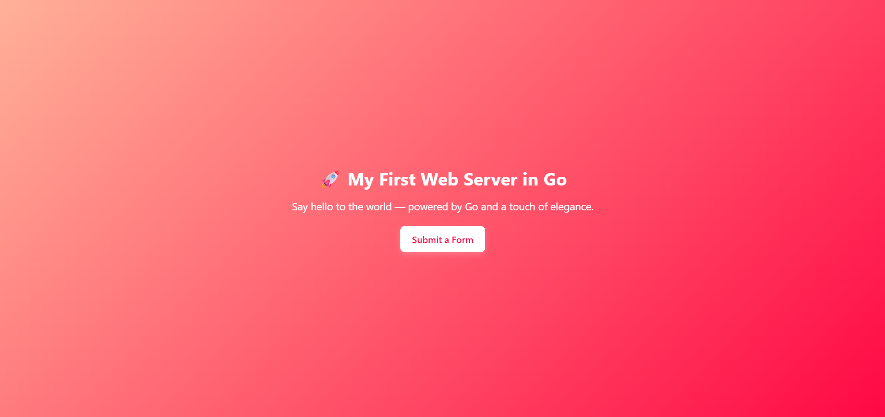

# 🌐 My First Web Server in Go

Welcome to my first Go web server project — a lightweight, elegant, and modern web application built with **pure Go (Golang)**.  
This project showcases how simple it can be to serve dynamic web pages and handle form submissions using Go’s standard library.

---

## 🚀 Overview

This project demonstrates:

- A **beautiful homepage** served by a Go web server.
- A **contact form** that sends POST data to the server.
- Clean, modern HTML and CSS with smooth animations.
- Zero external dependencies — built entirely with Go’s `net/http` package.

---
